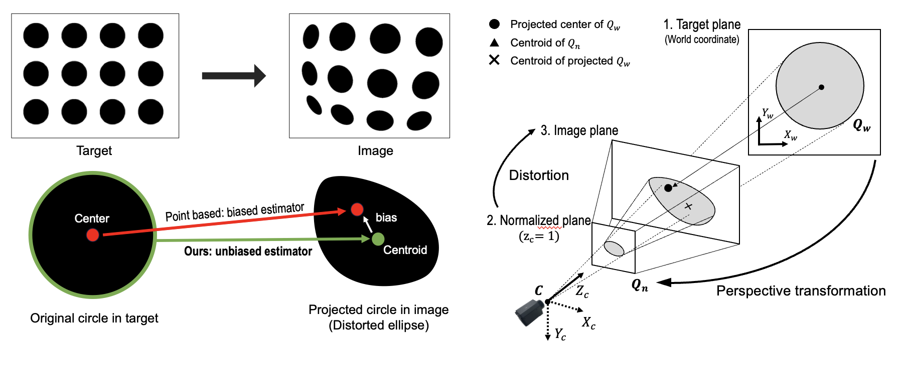

# DisCoCal: Unbiased Estimator for Distorted Conics in Camera Calibration

We proposed an unbiased estimator for centroid of distorted conic by leveraging "moment" from probability theory.

As shown above, the circle center is not projected to the centroid of the distorted ellipse under perspective transformation and distortion. Without considering geometery of the distorted ellipse, existing circular pattern-based calibration methods are biased, which leads low calibration accuracy than a checkerboard pattern. 

**Our unbiased estimator completes the missing piece in the conic-based calibration pipeline and outperforms the checkerboard pattern-based calibration.**

## Entire code will be released after the end of blind review period.

## Experiments

### Comparision between existing methods

Each calibration is conducted with randomly generated 30 images, and the entire process is repeated 30 times to obtain mean and standard deviation values.
Our method shows the best performance and significantly low standard deviation.

### Reprojection error comparison in synthetic images

With known intrinsic matrix, we evaluated the reprojection error to verify the projection model is well defined. Unlike other circular pattern methods, our method is unbiased, resulting in near-zero errors regardless of distortion and radius changes.

### Why Circular pattern?

The circular pattern has subpixel-level accuracy to detect the control points and is robust to boundary blur effects. These advantages are maximized in thermal-infrared cameras suffering from boundary blur effect due to thermal conduction.

